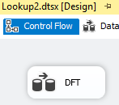
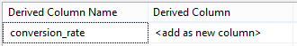
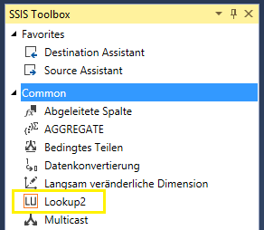
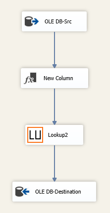
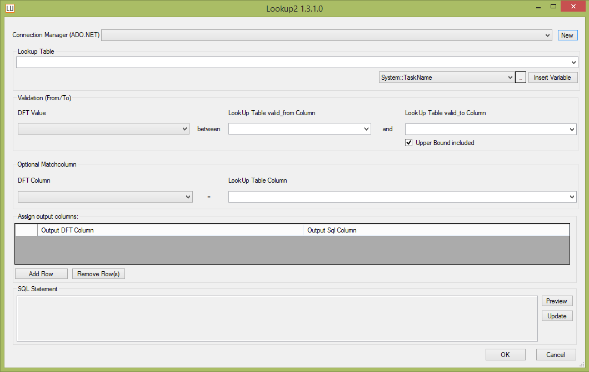
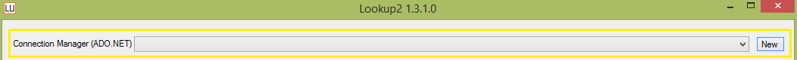
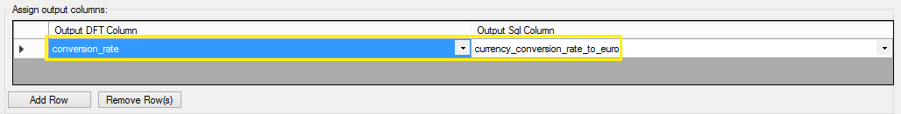

## initions SSIS Component "Lookup 2"
"Lookup 2" is a custom component for [SQL Server Integration Services](https://en.wikipedia.org/wiki/SQL_Server_Integration_Services). It can be added to the Data Flow of an SSIS-package to look up values in data ranges. 

The standard lookup transformation in SSIS lets you join data from a related table (lookup-table) based on **equal** values in common columns. For each value in your input is an exact matching value in the lookup-table.  
In some cases the values in the lookup-table are divided into consecutive ranges and only the beginning and ending values of each range is stored. To join this data you can not look for equal values but for the appropriate *data range*.    
The "Lookup 2" SSIS-Component enables you to do this in an easy way. 

---

### Requirements for development
* Microsoft VisualStudio 2010 or greater

### Requirements for usage
* Microsoft SSIS 2008R2 / 2012 / 2014

---

###Example: 

You want to know the currency conversion rate for US-Dollar to Euro on a specific date. The conversion rate changes over time, so it is valid between two dates (*valid-from* and *valid-to*). These dates are saved in a lookup-table.  
Let's say the currency conversion rate for Dollar to Euro was 1:1.2 between 2015-02-01 and 2015-02-15 and you made a purchase in US-Dollar on 2015-02-10.  
To get the rate for this date from the lookup-table you need to search for the currency (US-Dollar, country=1) and where the purchase-date is between *valid-from* and *valid-to*.

*Input-table:*

|purchase_date|country|value|
|---|---|---|
|2015-02-10|1|7.99|
  

*Lookup-table dbo.currency:*

|currency_conversion_rate_to_euro|FK_Country_ID|VALID_FROM|VALID_TO|
|---|---|---|---|
|1.3|1|2015-01-19|2015-01-31|
|1.2|1|2015-02-01|2015-02-15|
|1.17|1|2015-02-16|2015-02-27|

---

### How to use
1. open SSIS Package
2. create DFT and open it 
3. 
4. insert a src-component that gets your data you want to look up (i.e. purchase data)
5. create new column in your Data Flow to hold lookup2-return-value (i.e. conversion_rate)
6. 
7. find Lookup2 component in SSIS Toolbox, add it to Data Flow and connect its input to output of previous component
8. 
9. add a data-destination-component
10. 
11. open and configure "Lookup2" component:
    * 
    * choose a connection manager to access lookup-table
    * 
    * choose lookup-table (i.e. dbo.currency)
    * from your input (DFT Value) select column whose value is to look up in a data range (i.e. purchase_date) 
    * from your lookup-table select lower and upper range (i.e. VALID_FROM, VALID_TO)
    * from your input select an optional matchcolumn (i.e. country) and matching column in lookup-table (i.e. FK_Country_ID)
    * 
    * select output column to hold the returning value (i.e. conversion_rate)
    * 
13. Note: Non matching values return **NULL** as output column
14. done

---

### Bugs
If you find a bug, please contact us on GitHub

### Changelog
2016-02-27
First Release

### License
[MIT License](LICENSE)